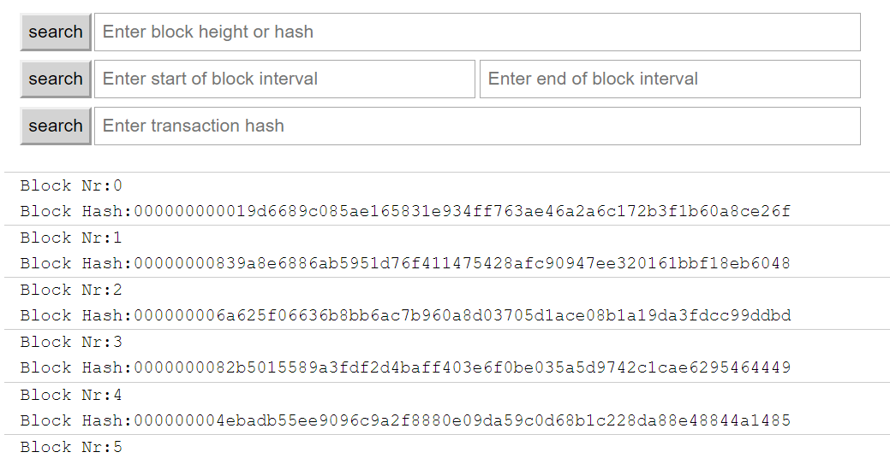
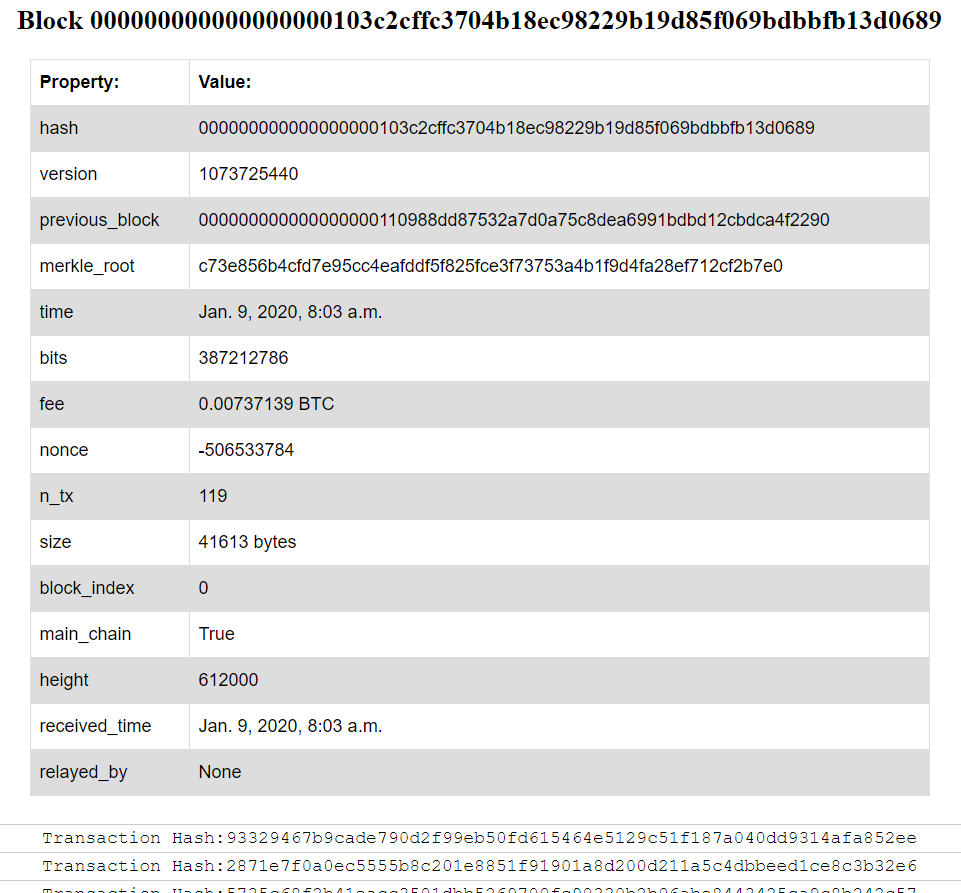
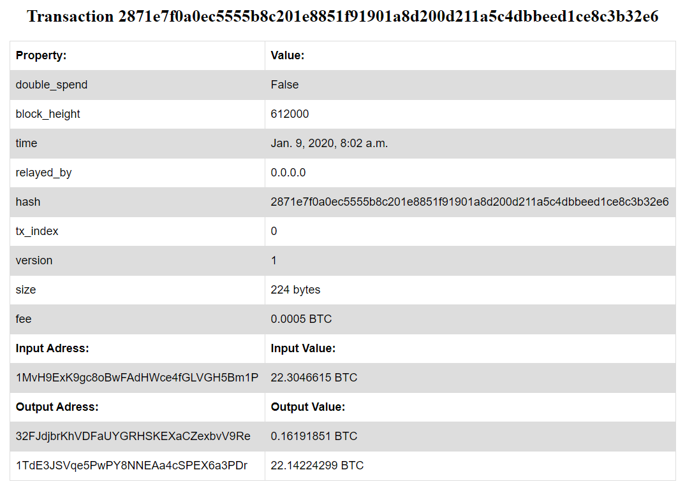

# Blockchain-BlockExplorer

## Mano Block Explorer

### Bendrai

Sukurta paprasta block explorer/blokų paieškos variklio programa. Programa realizuota python kalba naudojant "django"
ir "blockchain" bibliotekas. Django naudojama tinklo programėlės (web app) pustalių pavaizdavimui o "blockchain" biblioteka yra blokų grandinės API iš šios 
repositorijos - https://github.com/blockchain/api-v1-client-python.

### Paleidimas

Pagrindiniame repositorijos aplanke atsidarius komandinę eilutę panaudojama komanda "python manage.py runserver", taip inicijuojamas
serveris. Tada pasirnktoje naršyklėje (testavimas atliktas Google Chrome naršyklėje) į url vietą reikia suvesti 127.0.0.1:8000 arba
localhost:8000, taip patenkama i pagrindinį paieškos puslapį. Toliau vaikštoma po puslapius naudojant puslapyje esamas nuorodas.

### Pagrindinis (Search) puslapis

Realizuoti 3 paieškos būdai:
  1. Ieškomas konkretus blokas pagal jo aukštį arba hash'ą.
  2. Ieškomas blokų intervalas pagal pateiktą pradžios ir pabaigos blokų aukštį.
  3. Ieškoma konkrečios transakcijos pagal jos hash'ą.

### Bloko detalus puslapis

Pateikiama bloko header'yje esanti informacija, kaikurių reikšmių formatai pakeisti (timestamp reikšmės į datetime reikšmes, 
piniginės vertės pakeistos iš satoši į bitcoin, kaikur pridėti žymėjimai kaip "bytes" ir "BTC"). Taip pat pateiktas visų bloke esančių
transakcijų sarašas su nuorodomis į tų transakcijų detalius puslapius.

### Transakcijos detalus puslapis

Pateikiama transakcijos header'yje esanti informacija, kaikurių reikšmių formatai pakeisti, kaip ir blokuose, taip pat paskaičiuojamas
transakcijos mokestis "fee".

